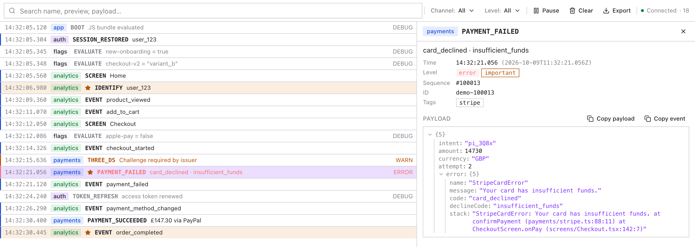

# rozenite-timeline-plugin

A [Rozenite](https://www.rozenite.dev) DevTools plugin that gives your React Native app's events their own timeline.

Analytics calls, feature-flag evaluations, auth transitions, payments, domain logs: everything that drowns in `console.log` gets a channel, a level and a JSON payload, in a filterable, searchable panel inside React Native DevTools. It does the job of Reactotron's `display()`, without leaving the official DevTools.

[](https://www.npmjs.com/package/rozenite-timeline-plugin)
[](./LICENSE)
[](https://www.rozenite.dev)

<p align="center">
  <picture>
    <source media="(prefers-color-scheme: dark)" srcset="docs/images/panel-dark.png" />
    
  </picture>
</p>

```ts
import { timeline } from 'rozenite-timeline-plugin';

timeline.log({ channel: 'analytics', name: 'EVENT', preview: 'checkout_started', payload: { cartId: 'c_42' } });
```

## Features

- **Log from anywhere**: `timeline.log()` is a plain function, so components, service classes, SDK wrappers and middleware can all call it. No React context needed.
- **Channels and levels**: group events by channel (`analytics`, `flags`, `auth`…), mark them `debug` / `info` / `warn` / `error`, highlight the important ones, add tags.
- **Nothing is lost before DevTools opens**: events go into a ring buffer from app start and are replayed when the panel connects or reloads.
- **Real-time**: while the panel is open, each event is sent synchronously inside the `log()` call, with no batching delay.
- **Fast panel**: a virtualized list that follows new events (and stops when you scroll up), a resizable detail pane with a collapsible JSON tree, search across names, previews, tags and payloads, channel and level filters, pause/resume, clear and JSON export. Light and dark themes come from `@rozenite/ui`.
- **Safe payloads**: cycles, `Error`s, `Date`, `Map`/`Set`, BigInt, functions and throwing getters are all serialized defensively, and payloads are capped at 64 KiB. A call can never throw into your app.
- **Zero cost when nobody is looking**: with no panel open (or the panel paused), `log()` only pushes onto the ring buffer.
- **Production-safe**: every export is a no-op stub in production builds, and the implementation is never bundled.
- **Agent tools**: coding agents can list, read, wait for and clear events through [Rozenite for Agents](https://www.rozenite.dev/docs/agent/overview), even with the panel closed. Ideal for checking that an action in the app logged what it should.

## Prerequisites

- [Rozenite](https://www.rozenite.dev/docs/getting-started) set up in your React Native or Expo project, with `@rozenite/metro`.
- See [Compatibility](#compatibility) for supported versions.

## Installation

```bash
npm install rozenite-timeline-plugin
```

```bash
bun add rozenite-timeline-plugin
```

Peer dependencies: `react` and `react-native`.

## Setup

### 1. Enable Rozenite in Metro

If your project doesn't use Rozenite yet, install `@rozenite/metro` and wrap your Metro config with `withRozenite`:

```bash
npm install -D @rozenite/metro
```

```js
// metro.config.js (Expo)
const { getDefaultConfig } = require('expo/metro-config');
const { withRozenite } = require('@rozenite/metro');

module.exports = withRozenite(getDefaultConfig(__dirname), { enabled: true });
```

```js
// metro.config.js (bare React Native)
const { getDefaultConfig, mergeConfig } = require('@react-native/metro-config');
const { withRozenite } = require('@rozenite/metro');

module.exports = withRozenite(mergeConfig(getDefaultConfig(__dirname), {}), {
  enabled: process.env.WITH_ROZENITE === 'true',
});
```

### 2. Call the hook once at your app root

```tsx
// App.tsx
import { useRozeniteTimelinePlugin } from 'rozenite-timeline-plugin';

export default function App() {
  // Safe to call unconditionally: a no-op in production.
  useRozeniteTimelinePlugin();

  return <Root />;
}
```

### 3. Log events

```ts
import { timeline } from 'rozenite-timeline-plugin';

timeline.log({
  channel: 'payments',
  name: 'PAYMENT_FAILED',
  preview: 'card_declined',
  payload: { amount: 14730, currency: 'GBP', error },
  level: 'error',
  important: true,
});
```

### 4. Open React Native DevTools

Restart Metro. Its logs list `rozenite-timeline-plugin` among the loaded plugins, and a **Timeline** panel appears in React Native DevTools.

## API

### `timeline.log(event)`

Records an event. Never throws.

```ts
timeline.log({
  channel: 'analytics',          // required; groups and filters events
  name: 'EVENT',                 // short type label, e.g. EVENT | SCREEN | IDENTIFY
  preview: 'checkout_started',   // optional one-line summary shown in the list
  payload: { any: 'value' },     // optional; shown as a JSON tree
  level: 'info',                 // 'debug' | 'info' | 'warn' | 'error'; default 'info'
  important: false,              // highlights the row
  tags: ['checkout'],            // searchable labels
});
```

Every event also gets an `id`, a `timestamp` (ms since the epoch) and a monotonic sequence number (`seq`).

Malformed input is coerced rather than rejected: a missing channel becomes `'default'`, a missing name becomes `'EVENT'`, and an unknown level becomes `'info'`. If anything inside the plugin fails, it warns once in the console and carries on; your app never sees the error.

### `timeline.channel(name)`

Returns a logger bound to one channel:

```ts
const analyticsTimeline = timeline.channel('analytics');

analyticsTimeline.log({ name: 'SCREEN', preview: 'Home', payload: { tab: 'feed' } });
```

### `timeline.clear()`

Empties the buffer in the app and in an open panel.

### `useRozeniteTimelinePlugin(options?)`

Connects the timeline to DevTools and registers the agent tools. Call it **once**, in a component that stays mounted, such as your app root. `timeline.log()` works without it; events just stay in the buffer until the hook mounts.

| Option      | Type     | Default | Description                                                  |
| ----------- | -------- | ------- | ------------------------------------------------------------ |
| `maxEvents` | `number` | `1000`  | Ring buffer capacity. The oldest events are evicted first.   |

### Types

`TimelineEventInput`, `TimelineChannelEventInput`, `TimelineEvent`, `TimelineLevel`, `JsonValue`, `Timeline`, `TimelineChannelLogger` and `RozeniteTimelinePluginOptions` are exported.

## Recipes

Illustrative and vendor-neutral: adapt them to your own SDKs.

### Analytics wrapper

A thin facade that mirrors every call to the `analytics` channel. In development you see exactly what would be sent; in production `timeline` is a no-op and only the vendor call remains.

```ts
// analytics.ts
import { timeline } from 'rozenite-timeline-plugin';
import { vendor } from './vendor-sdk'; // your analytics SDK

const analyticsTimeline = timeline.channel('analytics');

export const analytics = {
  track(event: string, properties?: Record<string, unknown>) {
    analyticsTimeline.log({ name: 'EVENT', preview: event, payload: properties });
    vendor.track(event, properties);
  },
  screen(name: string, properties?: Record<string, unknown>) {
    analyticsTimeline.log({ name: 'SCREEN', preview: name, payload: properties });
    vendor.screen(name, properties);
  },
  identify(userId: string, traits?: Record<string, unknown>) {
    analyticsTimeline.log({ name: 'IDENTIFY', preview: userId, payload: traits, important: true });
    vendor.identify(userId, traits);
  },
};
```

To log *instead of* sending in development, guard the vendor calls with `if (!__DEV__)`.

### Feature-flag evaluations

Record the key, value and source of every evaluation on a `flags` channel:

```ts
import { timeline } from 'rozenite-timeline-plugin';

const flagsTimeline = timeline.channel('flags');

export function getFlag<T>(key: string, fallback: T): T {
  const remote = flagClient.get(key); // your flag client
  const value = (remote ?? fallback) as T;
  const source = remote === undefined ? 'default' : 'remote';

  flagsTimeline.log({
    name: 'EVALUATE',
    preview: `${key} = ${JSON.stringify(value)}`,
    payload: { key, value, source },
    level: 'debug',
    tags: [source],
  });
  return value;
}
```

### Redux / state middleware

Log selected actions without pulling in the full Redux DevTools:

```ts
import type { Middleware } from '@reduxjs/toolkit';
import { timeline } from 'rozenite-timeline-plugin';

const stateTimeline = timeline.channel('state');
const LOGGED = /^(auth|cart)\//; // only the slices you care about

export const timelineMiddleware: Middleware = () => (next) => (action) => {
  const result = next(action);
  const { type, payload } = action as { type: string; payload?: unknown };
  if (LOGGED.test(type)) {
    stateTimeline.log({
      name: type.split('/')[0].toUpperCase(),
      preview: type,
      payload,
      level: type.endsWith('/rejected') ? 'error' : 'info',
    });
  }
  return result;
};
```

The same pattern works for Zustand (`subscribe`), MobX (`spy`) or any event emitter.

## Agent tools

The plugin registers tools under the `rozenite-timeline-plugin` domain for [Rozenite for Agents](https://www.rozenite.dev/docs/agent/overview), so coding agents (Claude Code, Cursor, Codex…) can read the timeline and check what your app did. The tools are available while `useRozeniteTimelinePlugin` is mounted, even with the panel closed.

| Tool             | Arguments | Returns |
| ---------------- | --------- | ------- |
| `list-events`    | filters (below), `since?` (ms epoch), `limit?` (default 50, max 500), `cursor?`, `order?` (`'desc'`, newest first, by default; or `'asc'`) | `{ items, page: { limit, hasMore, nextCursor? }, latestSeq }`. Payloads are left out unless you request the `payload` field. |
| `wait-for-event` | filters (below), `timeoutMs?` (default 10 000, max 25 000) | `{ event, timedOut, latestSeq }`: the first matching event, with its payload, or `event: null` on timeout |
| `get-event`      | `id` | `{ event }`, including its payload |
| `list-channels`  | none | `{ channels: [{ channel, count, lastTimestamp }], totalEvents }` |
| `clear`          | none | `{ cleared }`. Destructive: it also clears the panel. |

**Filters** shared by `list-events` and `wait-for-event`:
- `channel?`, `name?` and `level?`: a string or an array of strings; `name` is an exact match.
- `search?`: a case-insensitive substring of the name, preview, channel, tags or payload.
- `afterSeq?`: only events logged after this sequence number.

**Checking what an action did.** Every event has a monotonic `seq`, and `list-events` and `wait-for-event` both return the `latestSeq` so far. The usual agent loop:

1. Call `list-events` with `limit: 1` and note `latestSeq`.
2. Trigger the action in the app: a tap, a navigation, a request.
3. Either:
   - call `list-events` with `afterSeq` set to that value, to see exactly what the action logged; or
   - call `wait-for-event` (for example `{ "channel": "payments", "name": "PAYMENT_FAILED" }`) to block until the expected event shows up.

Prefer `afterSeq` over `since`: it doesn't depend on the device clock.

Cursors are anchored to sequence numbers too, so pages stay consistent while new events arrive.

From the CLI, with Metro running:

```bash
npx rozenite agent session create
```

```bash
npx rozenite agent rozenite-timeline-plugin call --session <id> --tool list-events --args '{"channel":"analytics","limit":20}' --fields id,seq,timestamp,name,preview,payload
```

```bash
npx rozenite agent rozenite-timeline-plugin call --session <id> --tool wait-for-event --args '{"name":"order_completed","timeoutMs":15000}'
```

## How it works

The plugin has two halves that talk over Rozenite's plugin bridge.

### App side

- `timeline.log()` pushes each event onto a ring buffer of `maxEvents` entries, from the moment the module loads.
- `useRozeniteTimelinePlugin()` connects the buffer to DevTools. When a panel says `hello`, the app replays the buffer in chunks (up to 100 events or 256 KB each), yielding between chunks so a full buffer never blocks the JS thread for long. After that, every new event is serialized and sent synchronously, inside the `log()` call.
- With no panel attached (or the panel paused), `log()` only pushes onto the buffer. Payloads are kept by reference and serialized later, when a panel or agent tool first asks for them. The exception is while an agent's `wait-for-event` call is pending: each new event is serialized so it can be matched.
- If the panel disappears without saying goodbye (window killed, laptop asleep), the app stops streaming once the panel's 30-second lease runs out.

### Panel side

- On mount, the panel asks for the buffer and then appends live events. It renews its lease every 10 seconds by asking for "anything after the last event I have", so a throttled background tab just catches up.
- Payloads arrive as JSON text and are parsed only for the event you open, so search runs directly over the text.
- **Pause** tells the app to stop sending, saving app CPU as well as screen updates. **Resume** fetches only what was logged meanwhile.

### Messages

| Message        | Direction    | Purpose |
| -------------- | ------------ | ------- |
| `hello`        | Panel → App  | Start (or resume) streaming after a given event; also renews the lease |
| `bye`          | Panel → App  | Stop streaming (panel closed or paused) |
| `clear`        | Panel → App  | Empty the app's buffer |
| `snapshot`     | App → Panel  | One chunk of the buffer replay |
| `events`       | App → Panel  | A newly logged event |
| `cleared`      | App → Panel  | The buffer was emptied |
| `device-ready` | App → Panel  | The app (re)connected or changed `maxEvents`; the panel answers with `hello` |

### Payloads

Payloads become plain JSON. Plain data takes a fast path (a cheap check, then native `JSON.stringify`). Everything else gets a readable stand-in:

| Input | Shown as |
| --- | --- |
| Cycles | `"[Circular]"` (shared, non-cyclic references are kept) |
| `Error` | `{ name, message, stack, cause?, …own fields }` |
| `Date` | ISO string |
| `Map` / `Set` | `{ __type: 'Map', size, entries }` / `{ __type: 'Set', size, values }` |
| BigInt, Symbol, RegExp | `"123n"`, `"Symbol(x)"`, `"/re/g"` |
| Functions | `"[Function: name]"` |
| Throwing getters | `"[Throws: message]"` |

Each payload is capped at 64 KiB of UTF-8 JSON, measured after encoding (plus limits on string length, entries and depth). Anything cut is marked `[Truncated]`, and the panel shows a "truncated" badge.

Two consequences of the lazy serialization:
- an object you mutate after logging, while no panel is attached, may show its later value, so log a copy if that matters;
- the buffer holds references to up to `maxEvents` payloads, so logging very large objects keeps them in memory until they're evicted.

### Production

With `process.env.NODE_ENV === 'production'`, every export is a no-op stub. Metro inlines `NODE_ENV`, so the `require()` of the real implementation sits in a dead branch that the minifier removes: neither the implementation nor `@rozenite/plugin-bridge` reaches your release bundle. You can leave `timeline.log()` calls in shipped code.

## Compatibility

| Dependency | Version |
| --- | --- |
| Rozenite (`@rozenite/metro`, plugin bridge) | 2.4+ |
| React Native | 0.76+ (New Architecture and Hermes supported) |
| Expo SDK | 52+ |
| Integrations | React Native; React Native Web via Rozenite for Web |

## Example app

`example/` is an Expo app that logs to several channels (`app`, `analytics`, `flags`, `auth`, `debug`, `perf`). It includes a stress payload (cycles, a `Map`, a BigInt and 200 KB of text) and a 500-event burst.

```bash
bun install
cd example
bun install
bun run plugin:refresh   # builds and packs the plugin, then unpacks it into node_modules
bun run ios              # or: bun run android
```

## Development

```bash
bun install
bun run dev         # Rozenite dev host on http://localhost:8888, with a simulated app
bun run test        # unit tests, plus panel <-> app round trips via @rozenite/testing
bun run typecheck
bun run build       # rozenite build → dist/
bun run verify:prod # checks the production no-op against real Metro bundles (see below)
```

`bun run dev` runs a **Simulate an app** flow (see `rozenite.config.ts`). It answers the panel like the real app, so you can work on the UI without a simulator.

`dist/` isn't committed. A `prepack` hook builds it, so `npm pack` and `npm publish` always ship a fresh build, and `prepublishOnly` runs the type check and tests before publishing.

### Verifying the production no-op

- `src/__tests__/react-native-entry.test.ts` checks that a production import never requires the implementation, and that the stubs survive malformed calls.
- `bun run verify:prod` does the following, using `scripts/verify-production-bundle.mjs` for the checks:
  1. Rebuilds, packs and reinstalls the plugin into the example app.
  2. Checks that the installed `dist/` matches the fresh build byte for byte.
  3. Exports the example's production iOS and Android bundles and greps them for strings that only exist in the plugin's implementation. None may appear.
  4. As a control, makes a development export, which must contain all of them.

## License

[MIT](./LICENSE)
